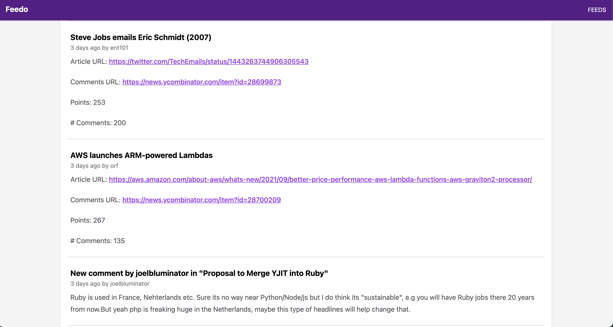
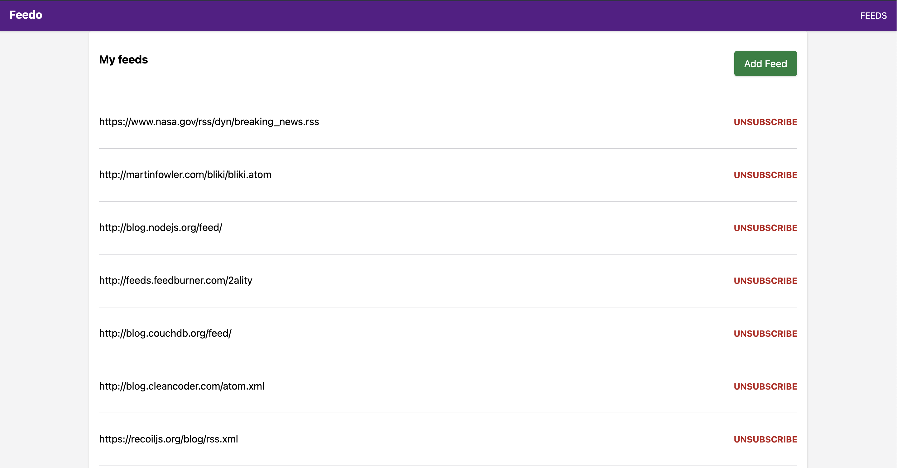
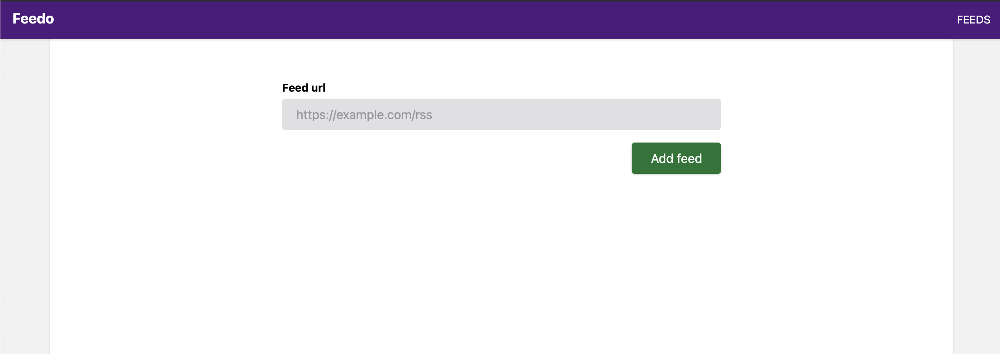
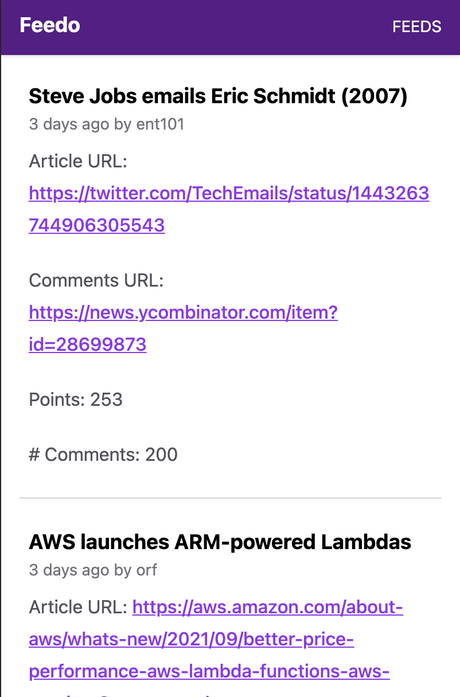

# Feedo

An RSS/Atom feed reader that runs on your laptop or on almost any free hosting provider or server.









## Quick start

This command will start feedo on your computer.

```shell
npm i -g feedo
feedo start -m -s 3h
```

That will start the web application at [http://localhost:8080](http://localhost:8080/).

## Development environment

1. Install dependencies:

    ```shell
    npm install
    ```

2. Create a `.env` based off `.env.example`.
3. Start the service in development mode

    ```shell
    npm run dev
    ```

## Hosted usage

If instead of running feedo on your own latop, you would prefer to run it on a server, here are
some guides to do so:

### Dokku

If you are using [Dokku](https://dokku.com/), create an App, and configure in the `.env` file the `DOKKU_*` variables, then
deploy it with:

```shell
    npm run deploy:dokku
```

Ensure you also setup all the necessary environment variables in dokku, with `dokku config set ...`.
You can see which ones are supported by looking at the [.env.example](./.env.example) file.
